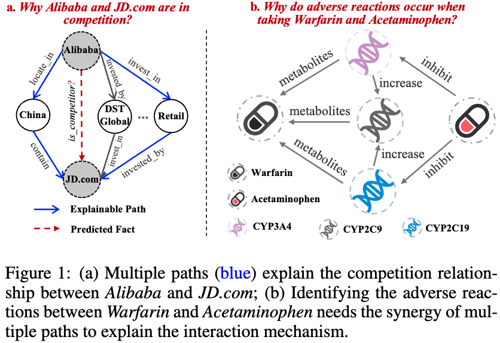

# Towards Synergistic Path-based Explanations for Knowledge Graph Completion: Exploration and Evaluation

The official implementation of paper "Towards Synergistic Path-based Explanations for Knowledge Graph Completion: Exploration and Evaluation, ICLR 2025"
## Abstract
Knowledge graph completion (KGC) aims to alleviate the inherent incompleteness of knowledge graphs (KGs), a crucial task for numerous applications such as recommendation systems and drug repurposing. The success of knowledge graph embedding (KGE) models provokes the question about the explainability: ``\textit{Which the patterns of the input KG are most determinant to the prediction}?'' Particularly, path-based explainers prevail in existing methods because of their strong capability for human understanding. In this paper, based on the observation that a fact is usually determined by the synergy of multiple reasoning chains, we propose a novel explainable framework, dubbed KGExplainer, to explore synergistic pathways. KGExplainer is a model-agnostic approach that employs a perturbation-based greedy search algorithm to identify the most crucial synergistic paths as explanations within the local structure of target predictions. To evaluate the quality of these explanations, KGExplainer distills an evaluator from the target KGE model, allowing for the examination of their fidelity. We experimentally demonstrate that the distilled evaluator has comparable predictive performance to the target KGE. Experimental results on benchmark datasets demonstrate the effectiveness of KGExplainer, achieving a human evaluation accuracy of 83.3% and showing promising improvements in explainability.



## Requiremetns

All the required packages can be installed by running `pip install -r requirements.txt`.
```
dgl==1.1.2
lmdb==1.4.1
networkx==3.0
scikit-learn==0.22.1
torch==2.0.0
tqdm==4.61.2
```

## Experiments
Below we take the family-rr dataset as an example.

### Datasets
To reproduce the results of KGExplainer and its variants, we release the datasets and checkpoints on [Google Driver](https://drive.google.com/file/d/1MbSke4r0kGT7QxxRjo-Ozls-gP3cZUjk/view?usp=drive_link). The results of baseline models are included.

### KGE pretraining
Pretrain knowledge graph embedding methods using the code from this [Link](https://github.com/DeepGraphLearning/KnowledgeGraphEmbedding) 
+ TransE
```
CUDA_VISIBLE_DEVICES=0 python -u run_kge.py --do_train \
 --cuda \
 --do_test \
 --data_path dataset/family-rr \
 --model TransE \
 -n 128 -b 1024 -d 128 \
 -g 24.0 -a 1.0 -adv \
 -lr 0.0001 --max_steps 150000 \
 -save ckpt/kge/TrasnE_family_0 --test_batch_size 16 
```
+ DistMult
```
CUDA_VISIBLE_DEVICES=0 python -u run_kge.py --do_train \
 --cuda \
 --do_test \
 --data_path dataset/family-rr \
 --model DistMult \
 -n 128 -b 1024 -d 128 \
 -g 24.0 -a 1.0 -adv \
 -lr 0.0001 --max_steps 150000 \
 -save ckpt/KGE/DistMult_family_0 --test_batch_size 16 
```
+ RotatE
```
CUDA_VISIBLE_DEVICES=0 python -u run_kge.py --do_train \
 --cuda \
 --do_test \
 --data_path dataset/family-rr \
 --model RotatE \
 -n 128 -b 1024 -d 128 \
 -g 24.0 -a 1.0 -adv \
 -lr 0.0001 --max_steps 150000 \
 -save ckpt/KGE/RotatE_family_0 --test_batch_size 16 
 -de
```


### Evaluator Distillation
- `python run_distill_kge.py --dataset family-rr`

### Evaluation of Explanations

- `python run_key_pattern.py --model TransE --dataset family-rr --top_k 2`


## Acknowledgment
If you make use of this code or the KGExplainer algorithm in your work, please cite the following paper:

	@inproceedings{kgexplainer_ma
	  title={Towards Synergistic Path-based Explanations for Knowledge Graph Completion: Exploration and Evaluation},
	  author={Tengfei Ma, Xiang song, Wen Tao, Mufei Li, Jiani Zhang, Xiaoqin Pan, Yijun Wang, Bosheng Song and Xiangxiang Zeng},
	  booktitle={Proceedings of International Conference on Learning Representations},
      pages={1--20},
	  year={2025}
	}

 
